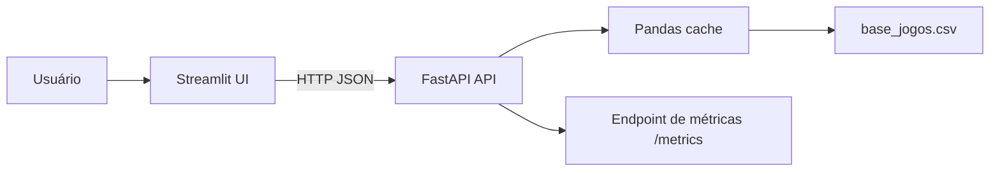
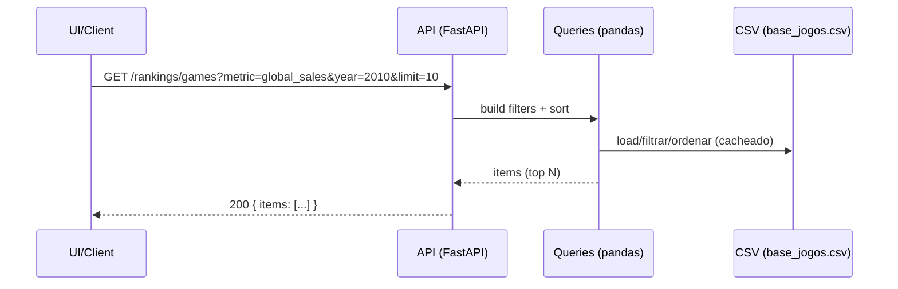
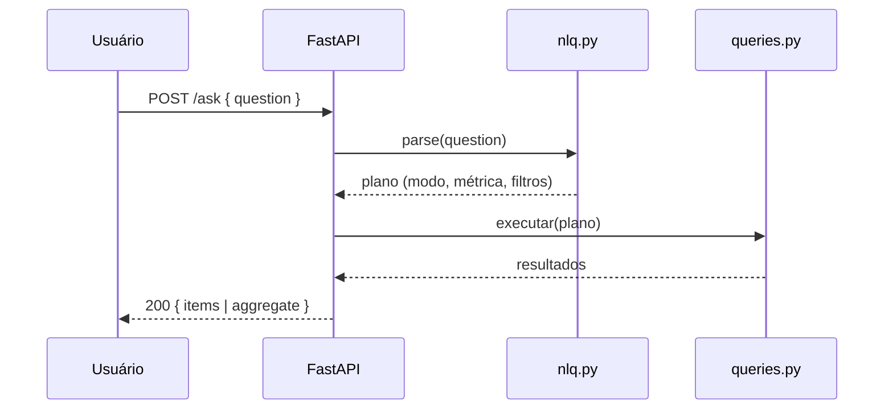

# FI_integracao_IA
# Teste de Engenheiro de Integracao — API + UI

Aplicação para responder **sobre vendas e avaliações de videogames** a partir do dataset `base_jogos.csv`.
O que foi desenvolvido:

* **API (FastAPI)** com endpoints de **panorama**, **rankings**, **detalhes**, **agregações** e **NLQ (/ask)**.
* **UI (Streamlit)**: **Panorama**, **Rankings**, **Explorar**, **Franquias/Agregados** e **Perguntas (NLQ)**.
* **Observabilidade**: (Prometheus).
* **Testes** (pytest) com **logs**.
* **Docker** (imagem com `targets` API/UI) + `docker-compose`.

Para facilitar a compreensão, desenvolvi um front em Streamlit que agiliza os testes da aplicação. Ainda assim, é possível executá-la sem o Streamlit para testar a API (FastAPI) isoladamente. Também há testes automatizados caso seja necessário validar todos os endpoints de uma só vez.
---

## Sumário

* [Requisitos e premissas](#requisitos-e-premissas)
* [Estrutura do projeto](#estrutura-do-projeto)
* [Como rodar (local)](#como-rodar-local)
* [Como rodar (Docker/Compose)](#como-rodar-dockercompose)
* [UI (Streamlit)](#ui-streamlit)
* [API (FastAPI) — Endpoints e exemplos](#api-fastapi--endpoints-e-exemplos)
* [Perguntas em linguagem natural (/ask)](#perguntas-em-linguagem-natural-ask)
* [Testes automatizados](#testes-automatizados)
* [Observabilidade](#observabilidade)
* [Diagramas](#diagramas)
* [Postman (opcional)](#postman-opcional)
* [Troubleshooting](#troubleshooting)

---

## Requisitos e premissas

**O que o serviço faz:**

1. Lê e disponibiliza o conjunto `base_jogos.csv`.
2. Consolida/prepara dados para **estatísticas** e **rankings**.
3. Oferece **endpoints**:

   * **Estatísticas descritivas** (panorama, agregados).
   * **Listas ordenadas** (rankings por métrica).
   * **Detalhes por jogo** e **autocomplete**.
   * **NLQ** (*natural language query*) para perguntas simples do tipo “Quais são os jogos mais vendidos em 2010?”.

**Dataset esperado (colunas padrão):**
`name, platform, genre, year, publisher, developer, rating, global_sales, na_sales, eu_sales, jp_sales, other_sales, critic_score, user_score`

**Variáveis de ambiente:**

* `DATA_PATH`: caminho do CSV (ex.: `./data/base_jogos.csv`).
* `API_URL` (UI): URL da API (ex.: `http://127.0.0.1:8000` ou, em Docker, `http://api:8000`).

---

## Estrutura do projeto

```
.
├── app/
│   ├── main.py              # App FastAPI
│   ├── queries.py           # Funções de leitura/consulta/ordenacão para pandas
│   ├── nlq.py               # Parser simples de NLQ
│   └── observability/
│       └── metrics.py       # FastAPI Instrumentator
├── streamlit_app/
│   └── Home.py              # UI
├── tests/
│   └── test_api_full.py # Teste: imprime tudo no terminal
├── data/
│   └── base_jogos.csv       # Dataset
├── requirements.txt
├── Dockerfile               
├── docker-compose.yml
└── README.md
```

---

## Como rodar local

### 1) API

```bash
python -m venv .venv

.\.venv\Scripts\activate


pip install -r requirements.txt

python -m uvicorn app.main:app --host 127.0.0.1 --port 8000 (Pode ser trocado para host 0.0.0.0)
```

* Health: `http://127.0.0.1:8000/healthz`
* Docs: `http://127.0.0.1:8000/docs`

### 2) UI (Streamlit)

Em outro terminal:

```bash
.\.venv\Scripts\activate

python -m streamlit run streamlit_app/Home.py --server.port 8501
```

* UI: `http://127.0.0.1:8501`

---

## Como rodar (Docker/Compose)

### Build & Up

```bash
docker compose build --no-cache
docker compose up -d
```

* API: `http://localhost:8000`
* UI:  `http://localhost:8501`

---

## UI (Streamlit)

Abas:

* **Panorama**: visão geral + Top 10 e evolução anual do Top 1 nos anos.
* **Rankings**: ranking por métrica, com **selects** de ano, plataforma e gênero.
* **Explorar**: autocomplete por nome; cartão e gráfico.
* **Franquias/Agregados**: média/soma por termo no nome (franquia), com filtros e evolução anual.
* **Perguntas (NLQ)**: campo de pergunta + exemplos rápidos; usa `POST /ask`.
---

## API (FastAPI) — Endpoints e exemplos

### Health

```
GET /healthz
```

**200**:

```json
{"status":"ok","dataset_loaded":true,"rows":12345}
```

### Panorama do dataset

```
GET /stats/overview
```

**200** (exemplo):

```json
{
  "total_titles": 7239,
  "year_range": [1980, 2020],
  "sum_global_sales": 5412.7,
  "avg_critic_score": 72.4,
  "avg_user_score": 7.5
}
```

### Metadados (opcional)

```
GET /meta/platforms
GET /meta/genres
GET /meta/years
```

**200**:

```json
{"items": ["PS3", "X360", "Wii", "PC", "DS"]}
```

### Rankings de jogos

```
GET /rankings/games
```

**Query params:**

* `metric`: `global_sales|na_sales|eu_sales|jp_sales|critic_score|user_score`
* Filtros (opcional): `year`, `platform`, `genre`
* Paginação: `limit` (default 10), `offset` (default 0)


### Detalhes de um jogo

```
GET /games/{name}
```

* `{name}`: nome exato (URL-encoded).
  **Exemplo:**

```bash
curl -s "http://localhost:8000/games/The%20Legend%20of%20Zelda%3A%20Twilight%20Princess"
```

### Autocomplete

```
GET /games/suggest?q=<termo>&limit=10
```

**Exemplo:**

```bash
curl -s "http://localhost:8000/games/suggest?q=zelda&limit=10"
```

**200:**

```json
{"items": ["The Legend of Zelda: ...", "The Legend of Zelda: ..."]}
```

### Agregados (franquia / termo no nome)

```
GET /stats/aggregate
```

**Query params:**

* `metric`: `critic_score|user_score|global_sales|na_sales|eu_sales|jp_sales`
* `name_contains`: termo para filtrar por **nome** (ex.: `zelda`, `mario`)
* Filtros opcionais: `platform`, `genre`, `year`, `year_from`, `year_to`

**200 (exemplo):**

```json
{"metric":"global_sales","count":18,"mean":4.23,"sum":76.2}
```

### NLQ — Perguntas em linguagem natural

```
POST /ask
Content-Type: application/json
{"question": "Quais são os jogos mais vendidos em 2010?"}
```

**200 (exemplo ranking):**

```json
{
  "mode": "rankings",
  "parsed": { "metric": "global_sales", "filters": {"year": 2010}, "limit": 10 },
  "items": [ ... ]
}
```

**200 (exemplo agregado):**

```json
{
  "mode": "aggregate",
  "parsed": { "metric": "critic_score", "name_contains": "zelda" },
  "aggregate": {"count": 22, "mean": 84.1, "sum": 1851.8}
}
```

## Perguntas em linguagem natural (/ask)

Exemplos prontos (funcionam na UI e via API):

* **“Quais são os jogos mais vendidos em 2010?”**
* **“Top nota crítica no PS3 em 2009”**
* **“Top vendas no Japão no Nintendo DS”**
* **“Jogos com melhor user score no PC”**
* **“Qual a média de nota da franquia Zelda?”**
* **“Soma das vendas globais da franquia Pokemon no DS de 2006 a 2010”**

O parser (`nlq.py`) mapeia palavras-chave → **métrica**, **filtros** e **modo**.

---

## Testes automatizados

Teste que percorre todas as rotas e **imprime tudo** no terminal (requisições, parâmetros, respostas truncadas):

```bash
# local
python -m pytest -s -q tests/test_api_full.py

# em Docker
docker compose exec api python -m pytest -s -q tests/test_api_full.py
```

O teste cobre:

* `/healthz`, `/stats/overview`, `/meta/*`
* `/rankings/games` (todas as métricas + filtros)
* `/games/{name}`, `/games/suggest`
* `/stats/aggregate` (média/soma por franquia/termo)
* `/ask`

---

## Observabilidade

* **Prometheus** via `prometheus-fastapi-instrumentator`.
* Métricas de requisições, latência por rota, status code, etc.
---

## Diagramas

### Arquitetura (containers)



### Fluxo de uma consulta



### NLQ (alto nível)



---

## Roadmap/Extras (O que poderia ser implementado)

* Embeddings/RAG (ex.: perguntas mais livres com contexto textual, fora do escopo atual).
* Prometheus + Grafana (dashboards prontos) e logs estruturados.
* Melhora no Streamlit para mais graficos e abas.
* Autocomplete mais robusto na pesquisa.

---
